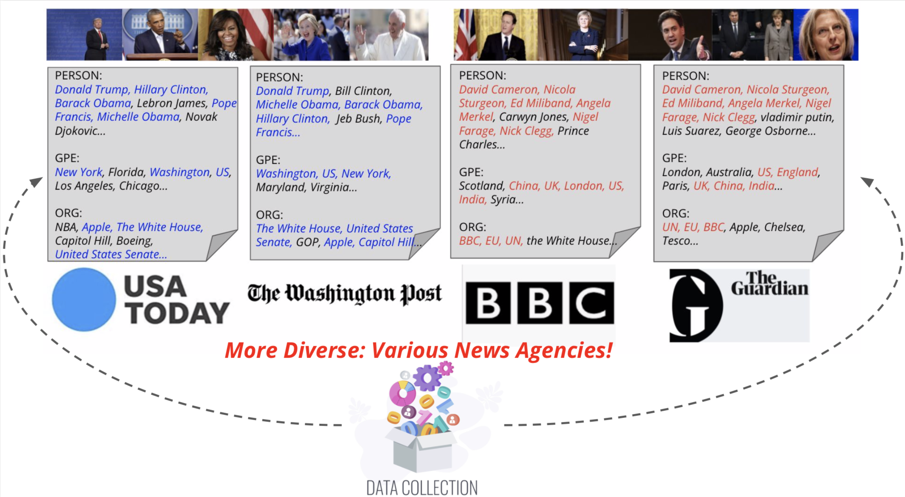
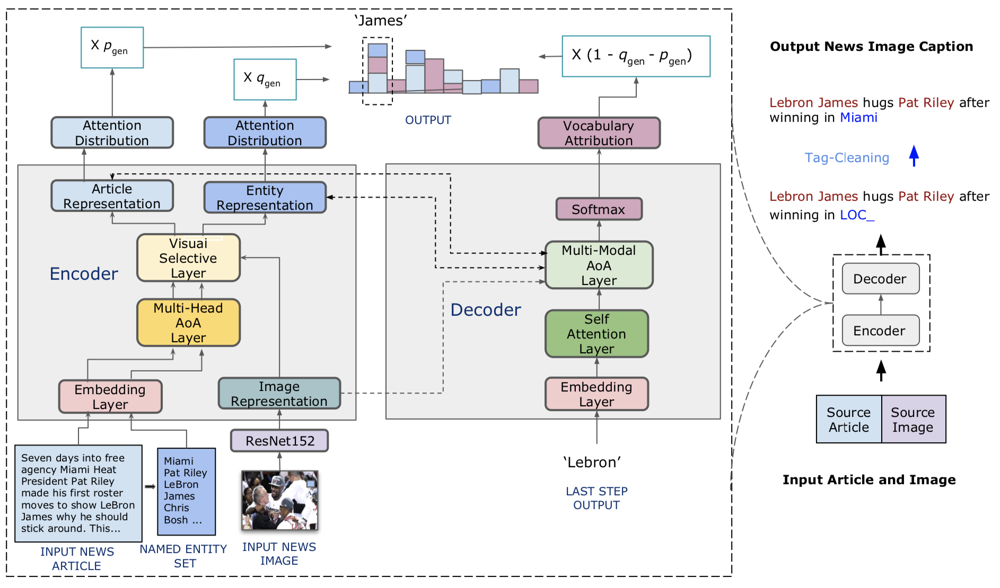

# [Visual News: Benchmark and Challenges in News Image Captioning](https://arxiv.org/abs/2010.03743)
Fuxiao Liu, [Yinghan Wang](https://www.linkedin.com/in/yinghan-wang-39980a119/), [Tianlu Wang](http://www.cs.virginia.edu/~tw8cb/), [Vicente Ordonez](https://www.vicenteordonez.com/)

## Abstract 
We propose Visual News Captioner, an entity-aware model for the task of news image captioning. We also introduce Visual News, a large-scale benchmark consisting of more than one million news images along with associated news articles, image captions, author information, and other metadata. Unlike the standard image captioning task, news images depict situations where people, locations, and events are of paramount importance. Our proposed method can effectively combine visual and textual features to generate captions with richer information such as events and entities. More specifically, built upon the Transformer architecture, our model is further equipped with novel multi-modal feature fusion techniques and attention mechanisms, which are designed to generate named entities more accurately. Our method utilizes much fewer parameters while achieving slightly better prediction results than competing methods. Our larger and more diverse Visual News dataset further highlights the remaining challenges in captioning news images.


## Dataset Examples


## VisualNews is more Diverse!


## Getting Data
- Our dataset is available upon request. Please contact fl3es@virginia.edu
- To access our dataset, please refer to this [demo](./VisualNews-Dataset.ipynb)
- Some of the articles have the image position, image titles and keyphrases. We will release it soon. Stay tuned!

   

## Requirements
- Python 3
- Pytorch > 1.0

## Model
This repo is under construction. If you have any questions, please email: fl3es@virginia.edu


## Resourse
- [PPT](./visualnews_ppt.pdf) 
- [Video](https://underline.io/lecture/37789-visual-news-benchmark-and-challenges-in-news-image-captioning)

## Citing
If you find our paper/code useful, please consider citing:

```
@misc{liu2020visualnews,
      title={VisualNews : Benchmark and Challenges in Entity-aware Image Captioning}, 
      author={Fuxiao Liu and Yinghan Wang and Tianlu Wang and Vicente Ordonez},
      year={2020},
      eprint={2010.03743},
      archivePrefix={arXiv},
      primaryClass={cs.CV}
}
```
