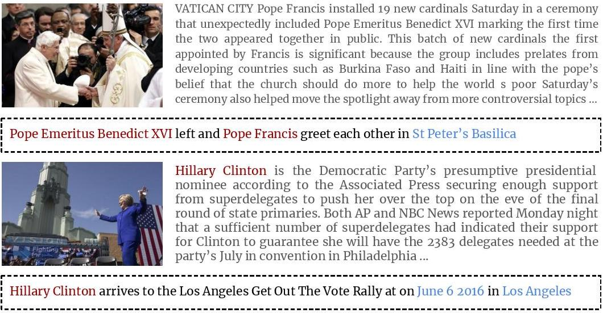

## [VisualNews : Benchmark and Challenges in Entity-aware Image Captioning](https://arxiv.org/abs/2010.03743)
Fuxiao Liu, Yinghan Wang, [Tianlu Wang](http://www.cs.virginia.edu/~tw8cb/), [Vicente Ordonez](https://www.vicenteordonez.com/)

### Abstract 
In this paper we propose VisualNews-Captioner, an entity-aware model for the task of news image captioning. We also introduce VisualNews, a large-scale benchmark consisting of more than one million news images along with associated news articles, image captions, author information, and other metadata. Unlike the standard image captioning task, news images depict situations where people, locations, and events are of paramount importance. Our proposed method is able to effectively combine visual and textual features to generate captions with richer information such as events and entities. More specifically, we propose an Entity-Aware module along with an Entity-Guide attention layer to encourage more accurate predictions for named entities. Our method achieves state-of-the-art results on both the GoodNews and VisualNews datasets while having significantly fewer parameters than competing methods. Our larger and more diverse VisualNews dataset further highlights the remaining challenges in captioning news images.



### Requirements
- Python 3
- Pytorch > 1.0

### Data
- Our dataset is available upon request. 
- To access our dataset, please refer to this [demo](./VisualNews-Dataset.ipynb)

### Code and Training
We are working on releasing code.

```sh
# Train the full model on VisualNews.
CUDA_VISIBLE_DEVICES=0 python train.py
```

There are also other model variants which are ablation studies.

| Experiment                       | Language Model |    Entity Guide |
| -------------------------------- | :-------------:| :--------------:|
| `1_lstm_basic`                   |           LSTM |                 |
| `2_lstm_EA`                      |           LSTM |                 |                 
| `3_lstm_EG`                      |           LSTM |               ✔ |                  
| `4_lstm_EA_EG`                   |           LSTM |               ✔ |               
| `5_lstm_EA_EG_Pointer`           |           LSTM |               ✔ |                
| `6_transformer`                  |    Transformer |                 |             
| `7_trasnformer_EG`               |    Transformer |               ✔ |                         

### Citing
If you find our paper/code useful, please consider citing:

```
@misc{liu2020visualnews,
      title={VisualNews : Benchmark and Challenges in Entity-aware Image Captioning}, 
      author={Fuxiao Liu and Yinghan Wang and Tianlu Wang and Vicente Ordonez},
      year={2020},
      eprint={2010.03743},
      archivePrefix={arXiv},
      primaryClass={cs.CV}
}
```
